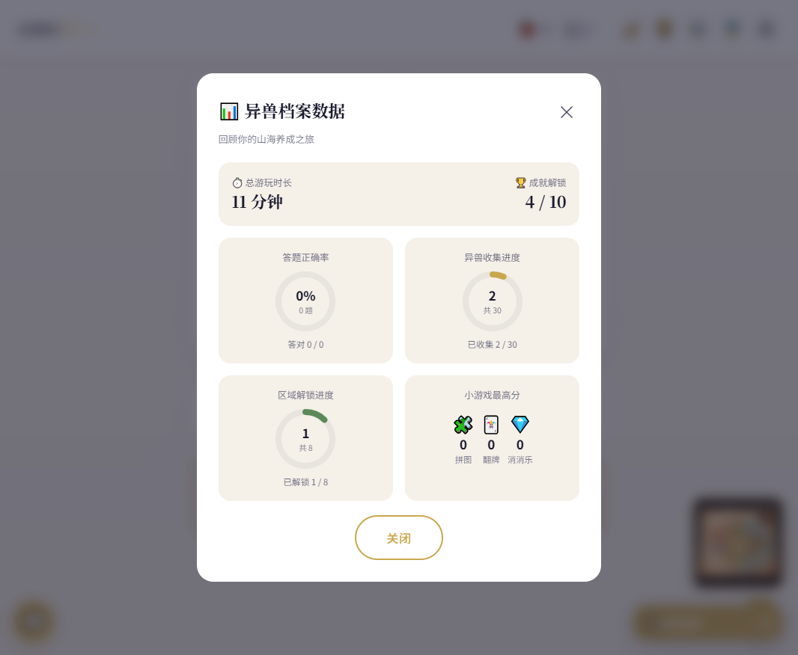

# 【娱乐生活赛道】《山海经异兽幼儿园》—— 让孩子在养宠物中爱上古籍（复赛）

## 一、自己/团队介绍

大家好，我是 会飞的哈士奇，一名热爱传统文化的全栈开发者。之所以做这个项目，源于一次观察：3岁的侄子对《神奇宝贝》如数家珍，却对中国自己的《山海经》一无所知。我突然意识到——问题不是孩子不爱传统文化，而是我们没有用孩子能理解的方式去呈现。

《山海经》里有450多种异兽，每只都有独特的形象、习性和故事，这本身就是最天然的"角色库"。为什么不让这些异兽成为孩子的"第一个朋友"？

第一次打开 TRAE IDE 时，我被它的能力震撼了——以前需要查文档、写样板代码的工作，用自然语言描述一下就能生成。从创意构思到代码实现，全程 AI 协作，效率提升了至少5倍。TRAE 更像是一个能力极强的搭档，帮你把框架搭起来、把细节补全，而你只需要专注产品设计和文化内容的把控。

这次复赛，我在初赛基础上新增了15+项功能，从游戏性、教育性、体验感三个维度全面升级——**让《山海经》从"束之高阁"变为"孩子心中的朋友"**。

**一个想用 AI 让古籍"活"起来的开发者**

***

## 二、产品简介

### 是什么？

《山海经异兽幼儿园》是一款面向 **3-10岁儿童** 的 **Web端互动养成游戏**（纯 HTML/CSS/JavaScript，零依赖，打开即用）。孩子从金蛋中孵化一只《山海经》异兽，通过喂养、玩耍、答题、探险等方式陪伴它成长——而获得"知识果实"的唯一方式，是回答关于这只异兽的《山海经》问题。**孩子在养宠物的过程中，不知不觉就记住了古籍内容。**

游戏融合了三种核心体验：

- **异兽养成**：从蛋期到成年期，20+种山海经异兽，每只都有独特性格和故事
- **知识答题**：学习不是任务，而是获得"知识果实"的奖励途径
- **山海探险**：塞尔达风格地图，八大区域探索，动态故事生成

### 面向谁？

**核心目标用户**：3-10岁儿童（学龄前至小学低年级）

**付费用户**：25-40岁家长，重视传统文化教育但缺乏有效工具

**教学用户**：幼儿园/小学教师，用作传统文化互动教学素材

**典型使用场景**：

1. 日常陪伴：孩子每天花10-15分钟照顾异兽，形成习惯
2. 睡前故事：家长和孩子一起"探险"，异兽成为睡前话题
3. 课堂辅助：教师用投影展示，全班一起认识新的异兽

### 完整功能

| 功能模块      | 具体功能            | 说明                                       |
| --------- | --------------- | ---------------------------------------- |
| **异兽领养**  | 选蛋孵化、命名、性格选择    | 3颗金蛋选一，孵化20+种异兽，4种性格（勇敢/害羞/活泼/温柔）        |
| **养成系统**  | 喂食、抚摸、玩耍、状态管理   | 饱食度/心情/成长值三条状态，知识果实喂食，心情系统               |
| **知识问答**  | 山海经题目、知识果实奖励    | 答对获得果实，果实用于喂食，学习=获得奖励                    |
| **异兽进化**  | 蛋期→幼年期→成年期      | 三阶段成长，外观变化，成年后金色光晕                       |
| **山海探险**  | 塞尔达地图、8大区域、动态故事 | 不规则区域设计，已解锁高亮/未解锁灰色，逐步解锁                 |
| **战斗系统**  | 随机战斗、胜负奖惩       | 遇到野生异兽触发战斗，胜利获果实和成长值                     |
| **休眠唤醒**  | 饱食度为0休眠、答题唤醒    | 把"学习"变成"救朋友"                             |
| **异兽图鉴**  | 20+异兽收集、详细档案    | AI生成插图、原文+译文+趣味知识、朗读功能                   |
| **原文查看**  | 拼音注音、白话译文、趣味知识  | `<ruby><rt>` 拼音标注，点击查看完整原文               |
| **声音朗读**  | 小女孩音色、有感情朗读     | Web Speech API，pitch=1.35，智能清理拼音注音防乱码    |
| **智能聊天**  | 异兽对话、AI接入支持     | 预设回复+豆包AI可选接入，保留对话历史                     |
| **益智小游戏** | 拼图、记忆翻牌、消消乐     | 三款游戏支持难度选择，完成后增加心情值                      |
| **每日签到**  | 连续签到、递增奖励、签到日历  | 签到弹窗弹性动画，奖励可视化                           |
| **任务系统**  | 每日任务、进度追踪       | 喂食/答题/探险任务，完成获额外奖励                       |
| **好友排行榜** | 成长值/知识量/收集数三维度  | 8位模拟好友+玩家，前三名特殊样式，邀请好友                   |
| **新手引导**  | 分步教程、高亮引导       | 首次进入引导，支持跳过                              |
| **暗黑模式**  | 全界面适配           | 一键切换，夜间护眼                                |
| **数据面板**  | SVG环形图可视化       | 总游玩时长/答题正确率环形图/异兽收集进度/区域解锁进度/小游戏最高分/成就解锁 |
| **结局画面**  | 成年后解锁           | 专属结局，展示养成成果                              |
| **分享卡片**  | Canvas绘制        | 可保存图片或分享到社交平台                            |
| **响应式适配** | 手机/平板/电脑        | 移动端单列触摸友好，桌面端多列网格                        |

### 用户使用路径

1. **选蛋孵化** → 选择一颗金蛋 → 异兽破壳出场 → 输入名字
2. **新手引导** → 分步教程了解功能 → 开始养成
3. **日常养成** → 知识问答获得果实 → 喂食异兽 → 抚摸/玩耍增加心情
4. **山海探险** → 打开地图 → 选择区域 → 动态故事 → 遇到异兽/战斗
5. **收集图鉴** → 探险发现新异兽 → 查看档案 → 朗读原文
6. **每日签到** → 签到领奖励 → 完成每日任务
7. **社交互动** → 和异兽聊天 → 查看排行榜 → 邀请好友
8. **异兽进化** → 成长值达标 → 蛋期→幼年→成年 → 解锁结局

### 相比初赛 Demo 的升级

| 升级项       | 初赛 Demo | 复赛完整版                          |
| --------- | ------- | ------------------------------ |
| **异兽进化**  | 无进化     | 蛋期→幼年期→成年期三阶段，外观变化+光晕效果        |
| **益智游戏**  | 无       | 拼图+记忆翻牌+消消乐三款，支持难度选择           |
| **好友排行榜** | 无       | 三维度排序（成长/知识/收集），8位模拟好友，邀请功能    |
| **每日签到**  | 无       | 连续签到递增奖励+签到日历+每日任务系统           |
| **声音朗读**  | 无       | 小女孩音色（pitch=1.35），有感情朗读，拼音乱码修复 |
| **原文查看**  | 无       | 拼音注音+白话译文+趣味知识，朗读按钮            |
| **新手引导**  | 无       | 分步教程，高亮引导，支持跳过                 |
| **地图风格**  | 简单矩形区域  | 塞尔达风格不规则区域，行书字体，悬停浮动感          |
| **聊天功能**  | 简单弹窗    | 左下角浮动图标+历史记录+AI接入支持            |
| **暗黑模式**  | 无       | 全界面暗黑适配，一键切换                   |
| **数据面板**  | 无       | SVG环形图可视化数据展示                  |
| **结局画面**  | 无       | 成年后解锁专属结局                      |
| **分享卡片**  | 无       | Canvas绘制，可保存/分享                |
| **加载动画**  | 无       | 精美加载动画                         |
| **响应式**   | 仅桌面     | 手机/平板/电脑全适配                    |
| **AI对话**  | 预设回复    | 预设回复+豆包AI可选接入                  |

***

## 三、产品演示视频

**在线体验地址**：<https://tubular-croissant-24a74c.netlify.app/>

**GitHub 仓库**：<https://github.com/Brokenlei/shanghaijing-Demo>

**产品演示视频**：

（待上传）

***

## 四、产品创作历程

### 创意诞生

灵感来自一次观察：3岁的侄子对《神奇宝贝》如数家珍，却对中国自己的《山海经》一无所知。我意识到，问题不是孩子不爱传统文化，而是我们没有用孩子能理解的方式去呈现。《山海经》里有450多种异兽，每只都有独特形象和故事，这本身就是最天然的"角色库"——为什么不让它们成为孩子的"第一个朋友"？

于是有了核心创意——**把《山海经》异兽变成孩子的养成宠物，让学习古籍变成"获得奖励的途径"**。

### 初赛阶段

初赛时提交了一个能跑通的 Demo：实现了选蛋孵化、基础养成、知识问答、山海探险、异兽图鉴等核心功能。验证了核心链路：孩子可以孵化异兽 → 答题获得果实 → 喂食养成 → 探险收集 → 图鉴查阅。

### 复赛迭代

**游戏性升级**

- 异兽进化系统：蛋期→幼年期→成年期，外观和光晕变化
- 益智小游戏：拼图、记忆翻牌、消消乐三款，难度可选
- 好友排行榜：三维度排序，模拟好友+邀请功能
- 每日签到+任务系统：双轨激励，持续留存

**教育性升级**

- 声音朗读：小女孩音色，有感情朗读，拼音乱码智能修复
- 原文查看：拼音注音+白话译文+趣味知识
- 新手引导：分步教程降低上手门槛

**体验感升级**

- 塞尔达风格地图：不规则区域，行书字体，悬停浮动感
- 聊天优化：浮动图标+历史记录+AI接入
- 暗黑模式、数据面板、结局画面、分享卡片、加载动画、响应式适配

### 关键决策

**为什么用纯 HTML 而不是框架？** 零依赖，打开即用，无需安装环境。适合快速验证创意，也方便部署到任何静态托管平台。对于参赛 Demo 来说，最简技术栈就是最好的选择。

**为什么选《山海经》而不是唐诗宋词？** 《山海经》有450多种异兽，每只都有独特形象和故事，天然适合做"角色库"。异兽形象鲜明、故事有趣、数量足够多，可以做很久的内容更新。而唐诗宋词更适合背诵，缺乏"养成"的趣味性。

**为什么把学习设计成"获得奖励的途径"？** "养成游戏 + 知识答题"的模式经过了验证（如《神奇宝贝》《旅行青蛙》）。把"学习"嵌入"获得奖励的途径"，比"学习任务"有效10倍。孩子为了喂异兽，会主动答题学知识。

**为什么朗读用小女孩音色？** 目标用户是3-10岁儿童，小女孩音色更有亲和力，孩子更愿意听。pitch=1.35 模拟高音调，rate=0.88 稍慢语速更有感情。同时智能清理 `<ruby><rt>` 拼音注音，避免朗读乱码。

***

## 五、TRAE 实践过程

整个 Demo 从0到1，完全用 **TRAE IDE + TRAE Work** 开发完成，从创意构思到代码实现，全程 AI 协作。

### 开发关键步骤

**步骤一：创意构思**
使用 TRAE Work 生成完整的创意提案，包括问题洞察、核心功能、差异化分析、商业模式等。AI 帮我把模糊的想法变成了结构化的方案。

**步骤二：主程序框架搭建**
使用 TRAE IDE 从零搭建 HTML 框架，包括欢迎页、孵化页、游戏主页三个核心界面。AI 根据描述自动生成了完整的页面结构、CSS 样式和 JavaScript 逻辑。

**步骤三：地图系统开发（6轮迭代）**

- 第一轮：基础地图和区域划分
- 第二轮：拖拽缩放和边界限制
- 第三轮：单 SVG 多 path 结构，解决点击区域重叠
- 第四轮：塞尔达风格不规则区域设计
- 第五轮：缩放限制（最小铺满，最大3倍）
- 第六轮：行书字体 + 悬停浮动感

**步骤四：探险与战斗系统**
动态故事生成、随机战斗、饱食度/心情消耗、休眠唤醒等完整游戏循环。

**步骤五：复赛15+项功能升级**

- 新手引导、异兽进化、结局画面
- 益智小游戏（拼图、记忆翻牌、消消乐）
- 每日签到+任务系统、好友排行榜
- 声音朗读（小女孩音色+拼音修复）
- 暗黑模式、数据面板、分享卡片
- 响应式适配、加载动画

### 开发心得

用 TRAE 开发最大的感受是：**从"我要写代码"变成了"我要设计产品"**。

以前做一个项目，80%的时间在写代码、调样式、改bug。现在这些事情 AI 都做了，我只需要想清楚"产品应该是什么样的"，然后用自然语言描述给 AI。

复赛阶段最大的挑战是**细节打磨**——朗读功能的拼音乱码问题，需要 AI 理解 `<ruby><rt>` 标签的工作原理并给出清理方案；布局叠加问题需要 AI 理解 CSS 的 `pointer-events` 和 `position: fixed` 的交互影响。这些问题通过多轮对话，AI 都能准确理解并修复。

最大的惊喜是**创意激发**。比如"饱食度为0时进入休眠，答题唤醒"这个机制，就是 AI 提出来的。"签到+任务系统"的双轨激励设计，也是在讨论中碰撞出来的。

***

## 六、技术方案分享

### 技术栈

| 层级    | 技术                     | 说明                                  |
| ----- | ---------------------- | ----------------------------------- |
| 前端    | 纯 HTML/CSS/JavaScript  | 零依赖，打开即用，单文件部署                      |
| 存储    | localStorage           | 本地存档，自动保存进度                         |
| 语音    | Web Speech API         | SpeechSynthesis 朗读，pitch=1.35 小女孩音色 |
| 地图    | SVG path               | 不规则区域路径，拖拽缩放交互                      |
| 动画    | CSS Animation + Canvas | 过渡动画、打字机效果、分享卡片绘制                   |
| AI 对话 | 豆包大模型 API（可选）          | 火山引擎，OpenAI 兼容格式                    |
| 部署    | Netlify + GitHub       | 自动部署，push 即更新                       |

### 架构设计

```
单个 HTML 文件（~410KB）
 ├── HTML 结构（游戏界面、弹窗、组件）
 ├── CSS 样式（响应式、暗黑模式、动画）
 └── JavaScript 逻辑
      ├── 状态管理（state 对象 + localStorage）
      ├── 游戏系统（养成/答题/探险/战斗）
      ├── UI 系统（弹窗/动画/音效）
      ├── 朗读系统（Web Speech API + 文本清理）
      └── AI 对话（豆包 API，可选）
```

### 关键技术点

**1. 拼音注音朗读修复**

原文使用 `<ruby>雘<rt>huò</rt></ruby>` 标注拼音，直接朗读会把拼音"huò"读出来。解决方案是在 stripHtml 之前先清理 `<rt>` 标签内容：

```javascript
function cleanTextForSpeech(text) {
    let s = typeof text === 'string' ? text : (text.innerHTML || '');
    s = s.replace(/<rt[^>]*>[\s\S]*?<\/rt>/gi, ''); // 移除拼音注音
    s = s.replace(/<ruby[^>]*>|<\/ruby>/gi, '');     // 移除 ruby 标签
    s = stripHtml(s);                                  // 移除剩余 HTML
    s = s.replace(/[āáǎàēéěèīíǐìōóǒòūúǔùǖǘǚǜñḿ]/g, function(m) {
        const map = { 'ā':'a','á':'a','ǎ':'a','à':'a', ... };
        return map[m] || m;
    });
    return s.trim();
}
```

**2. 小女孩音色朗读**

使用 Web Speech API 的高 pitch 模拟小女孩声音，优先选择中文女性语音：

```javascript
function getGirlVoice() {
    const voices = window.speechSynthesis.getVoices();
    const zhFemale = voices.find(v => v.lang.startsWith('zh') 
        && /female|女|woman|xiaoyan|tingting/i.test(v.name));
    return zhFemale || voices.find(v => v.lang.startsWith('zh'));
}

function speakText(text) {
    const u = new SpeechSynthesisUtterance(cleanTextForSpeech(text));
    u.lang = 'zh-CN';
    u.rate = 0.88;    // 稍慢语速，有感情
    u.pitch = 1.35;   // 高音调，小女孩
    const voice = getGirlVoice();
    if (voice) u.voice = voice;
    window.speechSynthesis.speak(u);
}
```

**3. 塞尔达风格 SVG 地图**

使用 SVG path 绘制不规则区域边界，支持拖拽缩放：

```javascript
// 区域交互
region.addEventListener('mouseenter', () => {
    region.classList.add('hover');
    // 悬停浮动感
});
region.addEventListener('click', () => clickRegion(regionId));
```

**4. AI 对话接入**

豆包 API 兼容 OpenAI 格式，带异兽角色 system prompt：

```javascript
async function generateAIResponse(userText) {
    const sysPrompt = `你是一只来自《山海经》的异兽，名字叫${state.name}...
    请用${personality}的语气回答，保持异兽角色设定。
    要求：1.回答简短（50字以内）2.适合3-10岁儿童 3.可引用山海经知识`;
    
    const resp = await fetch('https://ark.cn-beijing.volces.com/api/v3/chat/completions', {
        method: 'POST',
        headers: { 'Authorization': `Bearer ${API_KEY}` },
        body: JSON.stringify({
            model: ENDPOINT_ID,
            messages: [
                { role: 'system', content: sysPrompt },
                ...chatHistory.slice(-6).map(m => ({...})),
                { role: 'user', content: userText }
            ],
            temperature: 0.85,
            max_tokens: 150
        })
    });
}
```

**5. 响应式布局适配**

通过 CSS Grid 和媒体查询实现多端适配：

```css
/* 桌面端：多列网格 */
.game-body { display: grid; grid-template-columns: 1fr 1fr; }

/* 移动端：单列 */
@media (max-width: 480px) {
    .game-body { grid-template-columns: 1fr; }
    /* 按钮尺寸适合触摸 */
}
```

**6. 数据面板可视化**

使用 SVG 环形图展示养成数据，`stroke-dasharray` + `stroke-dashoffset` 实现进度动画：

```javascript
function buildRingSVG(percent, colorClass, mainText, subText) {
    const r = 36;
    const c = 2 * Math.PI * r;  // 周长
    const offset = c * (1 - percent / 100);  // 偏移量
    return `<svg width="86" height="86">
        <circle class="data-ring-bg" cx="43" cy="43" r="${r}" fill="none" stroke-width="8"></circle>
        <circle class="data-ring-fg ${colorClass}" cx="43" cy="43" r="${r}" fill="none" stroke-width="8"
            stroke-dasharray="${c}" stroke-dashoffset="${c}" data-target-offset="${offset}"></circle>
    </svg>`;
}
```

数据面板展示内容包括：

- **总游玩时长** + **成就解锁数**
- **答题正确率**环形图（答对题数/总题数）
- **异兽收集进度**环形图（已收集/30）
- **区域解锁进度**环形图（已解锁/8）
- **小游戏最高分**（拼图/记忆翻牌/消消乐）



***

## 七、后续计划

- **内容扩充**：异兽数量从20+扩展到50+，覆盖《山海经》主要篇章
- **小程序版本**：迁移到微信小程序，接入真实好友数据
- **AI 深度对接**：异兽能根据上下文智能对话，动态生成探险故事
- **亲子模式**：新增亲子共玩副本，家长和孩子一起探险
- **语音识别**：支持语音答题，降低低龄儿童使用门槛

***

## 标签

`生活娱乐` `传统文化` `儿童教育` `养成游戏` `山海经` `TRAE`

***

**在线体验**：<https://tubular-croissant-24a74c.netlify.app/>

**GitHub**：<https://github.com/Brokenlei/shanghaijing-Demo>

**感谢阅读！期待用 AI 的力量，让《山海经》里的异兽，真正"活"在孩子们的心中。**
